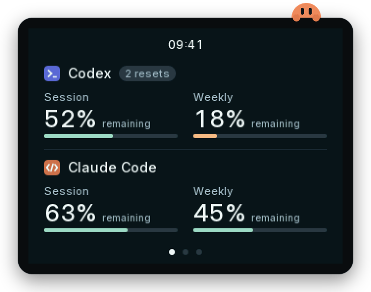
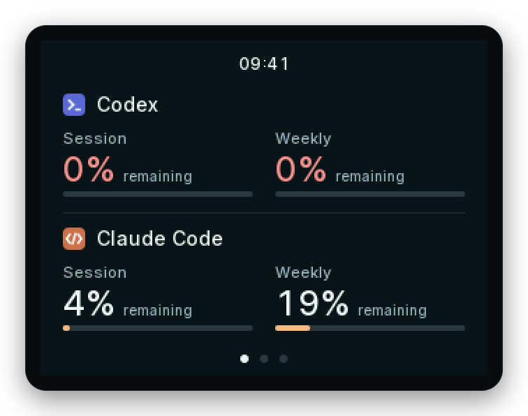
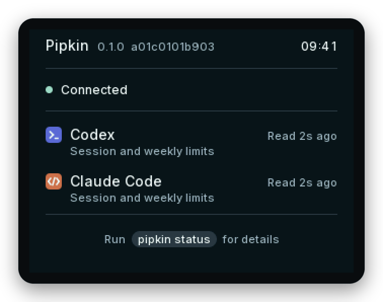
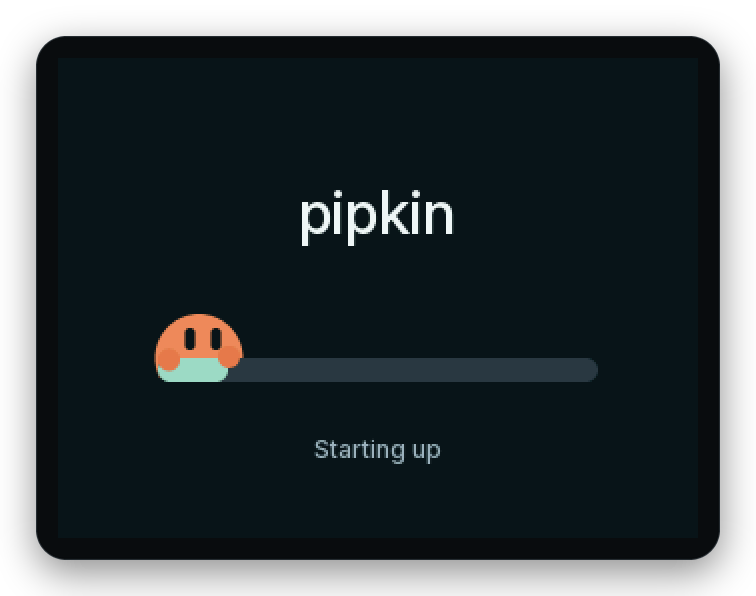

<h1 align="center">Pipkin</h1>

<p align="center"><strong>Your agentic AI allowance, at a glance.</strong></p>

<p align="center">
  
  
</p>

<p align="center">
  
</p>

Pipkin is a small desk display for people who build with Codex and Claude Code. It
sits beside your keyboard and shows how much of your session and weekly allowance is
left, and when it resets, so you never have to open a settings page mid-flow or get
caught out by a limit.

## What it shows

- **Overview:** Codex and Claude Code side by side, with session and weekly
  allowance for each.
- **Codex** and **Claude Code:** large, easy-to-read gauges with a countdown to each
  reset, plus any banked resets.
- **The time**, on every page.

Percentages show what you have **left**, with amber gauges when you're running low. Pipkin
is honest about what it knows: if a reading is out of date, or an app hasn't reported
something, the display says so rather than guessing.

<p align="center">
  
  
</p>

Swipe or tap to move between pages; Pipkin remembers your favourite. Hold anywhere on
the screen for three seconds to open the About/status page. Lift your finger, then tap
or swipe to return; it also closes after a minute untouched. When no new readings
arrive for a while, as when your computer is off or asleep, the screen dims and then
goes dark. It lights up again as soon as a new reading arrives, or for a minute at a
touch. That first touch only wakes the screen.

## Getting started

1. Install the [Pipkin CLI](https://github.com/damian-w/pipkin-cli), which reads your
   allowance and sends it to the display. It starts automatically each time you sign in
   to your computer. Step-by-step help is at [pipkin.io/start](https://pipkin.io/start).
2. Plug Pipkin into your computer with the USB cable.

<p align="center">
  
</p>

The CLI lives in its own repository, which covers installation, everyday commands,
privacy and exactly what it reads. This repository holds the display's firmware and
interface.

To update the display later, run `pipkin flash`. It checks the attached board and
current firmware, shows the latest published stable firmware version, and asks for
yes/no confirmation before writing. `pipkin update` updates the CLI itself. Flashing
requires CLI 1.1.0 or later; see the
[firmware guide](https://github.com/damian-w/pipkin-cli/blob/main/docs/firmware.md).

## Compatibility

The CLI supports macOS, Linux and Windows on ARM64 and Intel/AMD 64-bit.
See its [data sources and compatibility](https://github.com/damian-w/pipkin-cli/blob/main/docs/data-sources.md)
for supported sign-ins and credential stores.

## Build your own

Pipkin uses an **ESP32 “Cheap Yellow Display” (CYD)** board, available online for
roughly **$17 USD / $25 AUD**. [This AliExpress listing](https://www.aliexpress.com/item/1005009383089648.html)
is one example.

Install the CLI, connect your board with a USB data cable, then run:

```sh
pipkin flash
```

Pipkin checks the board, shows the firmware version it will install, and asks for
yes/no confirmation before flashing.

You can also [build and flash the firmware from source](docs/development.md#build-firmware-from-source).

<p>
  
  
  
</p>

## Licence

Pipkin's firmware, CLI, installers and documentation are source-available under the
[PolyForm Noncommercial License 1.0.0](LICENSE). You may use, build, modify and share
them for noncommercial purposes, including personal use, study and hobby projects.
Include the licence and its `Required Notice` line when sharing. Selling Pipkin or
products built from it needs separate permission.

If you own a Pipkin, whether a kit or one you've built yourself, you may also use this
software with it for any purpose, including paid work. See the
[terms of use](https://pipkin.io/terms).

Third-party components keep their own licences; see the
[firmware notices](https://github.com/damian-w/pipkin/blob/main/assets/NOTICE.md) and
[CLI notices](https://github.com/damian-w/pipkin-cli/blob/main/NOTICE.md).

Codex is a trademark of OpenAI. Claude and Claude Code are trademarks of Anthropic.
Pipkin is an independent product and is not affiliated with or endorsed by either
company.
